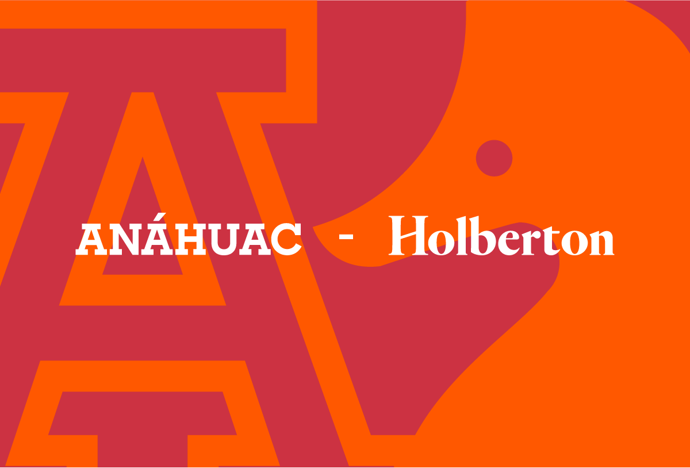

<h1>Simple Shell</h1>
Release date April 11, 2022
</p>

## Table of Contents
* [Requirements](#Requirements)
    * Output
* [Functions and system calls](#functions-and-system-calls)
* [Files](#Files)
* [GCC command to compile](#gcc-command-to-compile)
* [Flowchart](#flowchart)
* [Authors](#authors)

## Requirements
 * Allowed editors: vi, vim, emacs
 * All your files will be compiled on `Ubuntu 20.04 LTS`<a href="https://ubuntu.com/" target="_blank"> </a> using `gcc`, using the options `-Wall` `-Werror` `-Wextra` and `-pedantic`
 * All your files should end with a new line
 * A README.md file, at the root of the folder of the project is mandatory
 * Your code should use the `Betty` style. It will be checked using [betty-style.pl](https://github.com/holbertonschool/Betty/blob/master/betty-style.pl) and [betty-doc.pl](https://github.com/holbertonschool/Betty/blob/master/betty-doc.pl)
 * Your shell should not have any memory leaks
 * No more than 5 functions per file
 * All your header files should be include guarded
 * Use system calls only when you need to ([why?](https://www.quora.com/Why-are-system-calls-expensive-in-operating-systems))

 ### Output
* Unless specified otherwise, your program **must have the exact same output** as sh (/bin/sh) as well as the exact same error output.
* The only difference is when you print an error, the name of the program must be equivalent to your argv[0] (See below)

* Example of error with sh:
```
$ echo "qwerty" | /bin/sh
/bin/sh: 1: qwerty: not found
$ echo "qwerty" | /bin/../bin/sh
/bin/../bin/sh: 1: qwerty: not found
$
```